# 1. ROS 机械臂入门

各位同学大家好，欢迎来到睿思学院！我是睿思学院的罗云翔，我和我的伙伴王志强、徐晓毅、拓旭、肖鑫很高兴在这儿跟大家一起学习《ROS机械臂开发技术》这门课程。我们的第一门课程《机器人操作系统入门》是对ROS基础进行系统性的讲解。接下来，我们会针对不同的应用领域进行专题讲解，本门课程是《ROS机械臂开发技术》，之后我们还会推出《ROS SLAM和导航开发技术》等一系列课程。

本节课的内容主要分为以下几个方面，首先我们会简单讲述机械臂的发展概况，然后回顾一下ROS基础知识，了解我们使用ROS进行机械臂开发的理由，最后再讲一下ROS的安装与配置。

## 1.1 机械臂的发展现状

这一部分我们了解一下机械臂是什么，它的发展历史，工业机械臂领域的四大家族和机械臂发展的现状。

**机械臂是什么？**

机械臂是什么呢？机械手臂是指具有`模仿人类手臂功能`并可完成各种作业的`自动控制设备`，这种机器人系统`有多关节连结`并节允许在`平面或三度空间`进行运动或使用线性位移移动，构造上由`机械主体`、`控制器`、`伺服机构`和`感应器`所组成。下图是当今一些常见的机械臂。

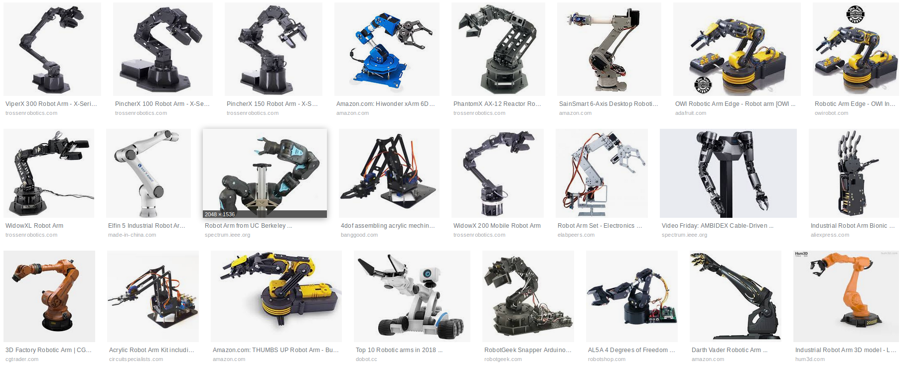

**机械臂发展历史**

1954年美国人乔治·德沃尔（George Devol），下图这个帅哥，最早提出了工业机器人的概念，并申请了专利。

<iframe height=498 width=510 src='http://player.youku.com/embed/XNzE3NTA2ODQw' frameborder=0 'allowfullscreen'></iframe>


该专利的要点是借助伺服技术控制机器人的关节。1956年乔治·德沃尔（George Devol）和物理学家约瑟·英格柏格（Joe Engelberger）成立了一家名为Unimation的公司，研发出第一台工业用机械手臂，名为“Unimate”。

<video src="src/videos/UNIMATE - ROBOT.mp4"></videos>

Unimate在美国市场生意惨淡，1969年，Unimation公司的工业机器人进入经济正在起飞的日本市场。Unimation公司与日本川崎重工（Kawasaki Heavy Industries）签订许可协议，生产Unimate机器人专供亚洲市场销售。川崎把开发和生产能节省劳动力的机器人和系统作为一项重要任务来完成，成为日本在工业机器人领域的先驱。1969年，川崎重工公司成功开发了Kawasaki -Unimate2000机器人，这是日本生产的第一台工业机器人。

<video src="src/videos/1968 The Kawasaki Unimate.mp4"></videos>

机械臂发展历史经历了40-50年代“萌芽”、60-70年代“初级”、80-90年代“迅速发展”、当前“智慧化”四个阶段。

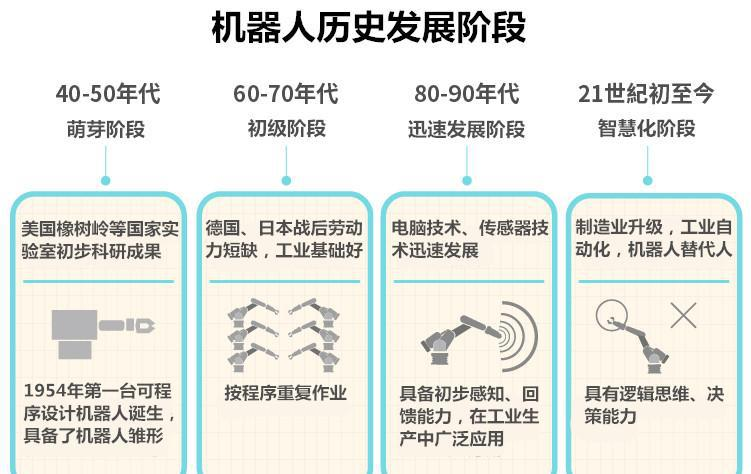

下面我们看一个视频，了解一下没上过大学的乔治·德沃尔是如何发明第一个数字、可编程机械臂的。希望同学们向乔治·德沃尔学习，英雄不问出处，只要你胸中有梦想、勇于实现，相信大家都会创造奇迹。

<video src="src/videos/Industrial Robots History.mp4"></videos>

**当今的机械臂**

起初制造机器人更多地目的是把它作为一种自动化装置，服务于制造业。随着理论和技术的日益成熟，人们对机器人提出了越来越高的要求。越来越多的场合需要机器人或者机械臂这种自动化装置为我们服务。ROS MoveIt！2017年底发布了一个5周年纪念视频，展示了最新的机械臂开发成果。

```
MoveIt!是ROS的机械臂运动规划框架(Motion Planning Framework)
```
<video src="src/videos/MoveIt! Montage 2017.mp4"></videos>

**工业机器人四大家族**

在当前的全球工业机器人业界中，以瑞士的ABB、德国的库卡、日本的发那科和安川电机最为著名，并称工业机器人四大家族。四大家族占据中国机器人产业70%以上的市场份额。传统的工业机械臂开发大都闭源，开发方法不通用，而且设备非常昂贵，这对我们学习制造了很大的障碍。

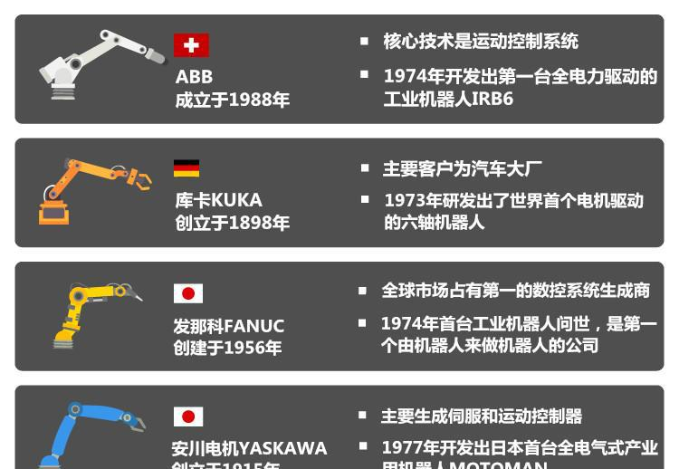

---

## 1.2 什么是ROS？

什么是ROS呢？ROS是Robot Operating System（机器人操作系统）的简写。我们可以这样理解，首先ROS的目的就是为了提高机器人开发过程中软件的复用率。虽然ROS中有OS，也就是操作系统的意思，但是ROS并不是向我们所说的Windows、Linux这样的计算机操作系统。它其实是运行在Linux上的上的一个中间件，一个中间件连接了真正的操作系统和你写的程序。只不过ROS提供了类似于操作系统的功能，比如说硬件抽象、底层设备控制、常用功能实现、进程间消息传递、程序包管理等。

接下来我们看看ROS能做什么？以下录像是2017年底ROS诞生10周年官方发布的视频。

<video src="src/videos/ROS 10 Year Montage.MP4"></videos>


为了方便理解，我们可以把ROS理解成框架+工具+功能+社区。

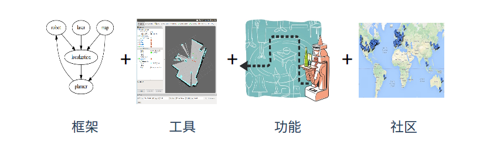

**框架**


我们一个一个来看。首先，是框架，这也是ROS最重要的概念。框架，就是ROS给你定好了一套规范。ROS采用了一种分布式架构，可以同时运行多个进程，每个进程能单独设计，然后放在一起组合起来。


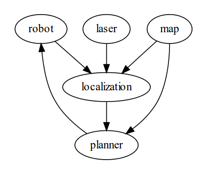

- 分布式

- 进程管理

- 进程间通信

**节点（Node）**

在ROS里，进程有个名字，叫做节点—node。请记住这个词，节点node。

以上面这张图为例，机器人控制是一个node，激光雷达采集是一个node，还有建图、定位和路径规划都是一个node。ROS提供了这样的一套框架，管理这些节点，然后提供了它们相互之通信的桥梁。那有了这样的一套程序组织，我们运行了这几个节点，机器人就可以实现自主导航功能。

那为什么要用这种分布式架构呢？分布式框架的好处是扩展性好，软件复用率高。比如现在我想换一个更高级的激光雷达，怎么办哪？ 我告诉大家，只用改这个激光雷达节点就行了，只用改这个节点就行了。甚至，我们连通信都不用改只要让新的传感器按照ROS规定的这个通信方式传输数据就可以。

是不是很方便？这就是分布式架构的好处。当然在实际情况下，各种节点啊要比这张图复杂很多，我们在《机器人操作系统入门》这门课程里有详细介绍。

**工具**

ROS提供了很多基础工具比如Gazebo，Rviz，rqt等等，用来仿真和调试，我们在《机器人操作系统入门》这门课程里有详细介绍。有了这些工具，开发人员面对的是可视化界面，而不再是字符串或者16进制数据，仿真和调试就容易多了。

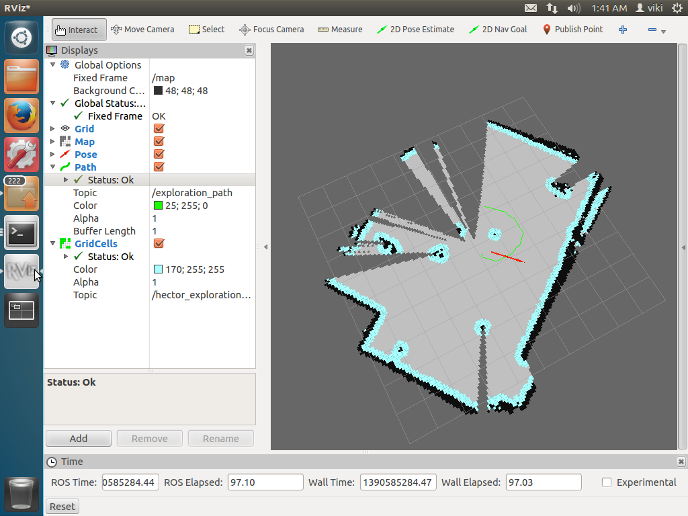

- 仿真（Gazebo）
- 数据可视化图形工具（rqt，rviz）
- 数据记录（rosbag）

Gazebo

Gazebo是ROS中的一个实现物理仿真的工具包，Gazebo本身就是一款机器人的仿真软件，可以模拟机器人以及环境中的很多物理特性

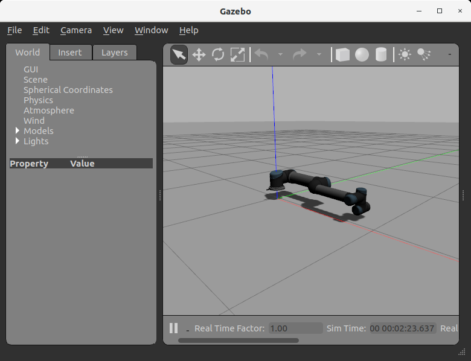

rviz

rviz是ROS自带的一个图形化工具，可以方便的对ROS的程序进行图形化操作。其使用也是比较简单。


**功能**

ROS提供了各种基础功能包，像控制啊、规划啊、视觉啊等等很多很多，你可以直接使用。 

比如说你现在正在研究人脸识别算法，你想把它用在机器人上，让机器人识别你的脸，然后跟随你那你不需要自己去写一套路径规划、建图、定位、控制的算法，你可以直接用它的开源程序，加上我写的人脸识别算法。有了这些基础功能，你们就可以只做自己擅长的那一部分。这也体现了ROS分布式框架的好处。去哪里找这些软件包啊？有两个！


 一个是机器人操作系统的官方网站--ROS Wiki 。

- http://wiki.ros.org/cn 

- http://wiki.ros.org/APIs

那这就是ROS的官方网站，我们可以看到有各种介绍和新闻，那最重要的就是这里，ROS Wiki，他相当于ROS提供的一个百科，或者官方手册里面包含了从安装到入门，各种软件包，以及ROS支持的机器人、传感器，还有相关的书籍和课程。如果你做ROS开发，这里会是你经常来的地方。

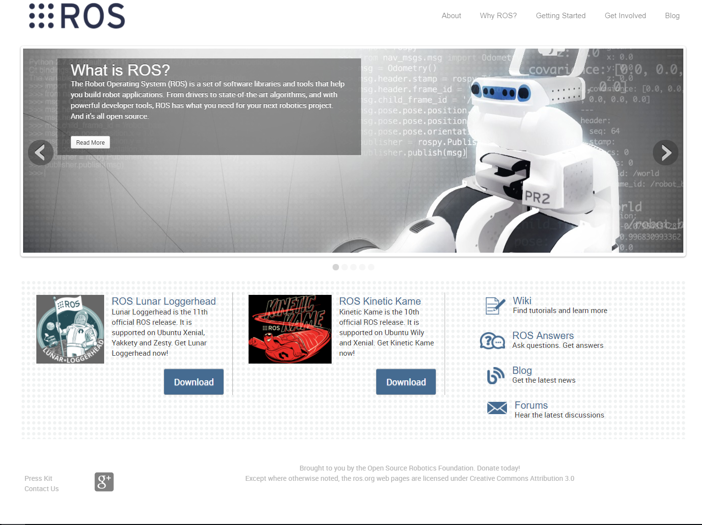

另一个是github，是一个面向开源及私有软件项目的托管平台,因为只支持git 作为唯一的版本库格式进行托管,故名gitHub，我们来看一下公司在github上的官方网页。

- https://github.com/DroidAITech

重德智能目前推出的产品和解决方案包括面向高校和科研院所的XBot系列科研教学机器人专业平台、校企共建联合实验室整体解决方案、服务机器人解决方案、共享机器人以及面向学校和机器人爱好者的基于ROS的机器人教学平台-睿思学院（ROSAcademy）。


- https://github.com/DroidAITech/xbot
我们可以点开xbot这个项目，点开之后我们可以看到这个目录下的一些项目文件，在最下方的README部分，有我们Xbot机器人的介绍，在ROS官方网站中也可以找到我们的Xbot机器人。

**社区**

最后一点，广义上我们讲ROS也是一个庞大的社区/生态系统很多ROS程序都是以软件包形式管理，安装和使用都很方便，此外ROS还提供了大量的文档和教程，ROS Wiki上都有。

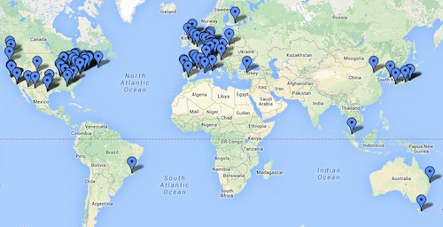

- 软件包管理
- 文档
- 教程


ROS，就是这样一个软件工具集，它包括了框架、工具、功能和生态系统。

经过以上对ROS的讲解，我们来回顾一下ROS具有哪些特点：

- **分布式点对点**

  ROS采用了分布式的框架，通过点对点的设计让机器人的进程可以分别运行，节点以分布式网络的形式建立，每个节点可以运行在不同的主机，便于模块化的修改和定制，提高了系统的容错能力。

- **工具包与各组件丰富**

  ROS采用组件化的方式将已有的工具和软件进行了集成，比如ROS中三维可视化平台Rviz，Rviz是ROS自带的一个图形化工具，可以方便的对ROS的程序进行图形化操作；ROS中常用的物理仿真平台Gazebo，在该仿真平台下可以创建一个虚拟的机器人仿真环境，还可以在仿真环境下添加一些需要的参数。

- **支持多种语言编程**

  ROS支持多种编程语言。C++、Python和已经在ROS中实现编译，是目前应用最广的ROS开发语言，Lisp、C#、Java等语言的测试库也已经实现。为了支持多语言编程，ROS采用了一种语言中立的接口定义语言来实现各模块之间消息传送。通俗的理解就是，ROS的通信格式和用哪种编程语言来写无关，它使用的是自身定义的一套通信接口。

- **开源社区**

  ROS具有一个庞大的社区ROS WIKI，这个网站将会始终伴随着你ROS开发，无论是查阅功能包的参数、搜索问题还是。当前使用ROS开发的软件包已经达到数千万个，相关的机器人已经多达上千款。此外，ROS遵从BSD协议，对个人和商业应用及修改完全免费。这也促进了ROS的流行


## 1.3 ROS Moveit! 机械臂开发简介

**机械臂系统构架**

机械臂的系统构架主要包括用户接口，ROS参数服务器，机器人约束条件，适配器，监听信息，五部分组成。


**用户接口**

用户接口是实现用户和机器人进行交互（如发送命令让机器人到达某个位姿）。用户可以使用C++、Python或者GUI来访问move_group。一般对于初学者来说，GUI和Python的使用会更多一些。

**ROS参数服务器**

move_group本质上还是一个ROS的节点，它需要使用ROS的参数服务器来获取以下三种信息：

- URDF：
move_group需要机械臂的URDF文件来进行运动规划

- SRDF：

move_group在启动时会寻找机械臂的SRDF文件，它可以通过使用MoveIt! Setup Assistant自动生成。

- MoveIt!配置：

move_group在启动时会加载机械臂的关节限位、动力学、运动规划、感知以及其他相关信息。所有以上的配置信息都可以通过使用MoveIt! Setup Assistant自动生成。

**机器人约束条件**

在让运动规划器进行运动规划之前，我们要先发送一个运动规划的请求。这个请求可以是新的机械臂或末端执行器的位置。为了让运动规划器规划出来的轨迹符合要求，我们需要指定一些约束条件：

- 位置约束：

约束机械臂Link的位置。

- 方向约束：

约束机械臂Link的方向。

- 可见性约束：

约束Link上的某点在某些区域的可见性。

- 关节约束：

约束Joint的运动范围。

- 自定义约束：

使用自定义的回调函数来指定约束条件。

**适配器**：

在运动规划器的输入输出端分别有两个规划请求适配器。它们的作用分别是对规划请求和规划结果进行预处理和后期处理。MoveIt!提供了几种默认的适配器来完成一些特定的功能。

- FixStartStateBounds:

当机械臂的一个或多个关节的初始状态稍微超出了URDF文件中所定义的Joint Limits后，为了能让运动规划器可以运行，FixStartStateBounds适配器会通过将关节状态移动到Joint Limits处来解决这个问题。不过，如果机械臂关节的偏差很大的话，这种靠软件方式修正的方式就不适用了。

- FixWorkspaceBounds:

这个适配器会默认地生成一个10x10x10立方米的机械臂规划空间。

- FixStartStateCollision:

如果已有的关节配置文件会导致碰撞，这个适配器可以采样新的配置文件，并根据摇摆因子来修改已有的配置文件，从而保证新的机械臂不会发生碰撞。

- FixStartStatePathConstraints:

如果机械臂的初始姿态不满足路径约束，这个适配器可以找到附近满足约束的姿态作为机械臂的初始姿态。

- AddTimeParameterization:

这个适配器非常重要。它把从运动规划器中输出的空间路径按等距离进行划分，并在其中添加加速度、加速度约束，以及时间戳等必要信息。

**监听信息**：

Planning Scene用来表示机械臂周围的外部世界并且保存机械臂自己本身的状态。它通过监听对应的Topic来获取关节状态信息、传感器信息。并可以根据传感器信息和用户的输入，生成机器人周围3D世界空间的表示。

**Planning Scene**


3D Perception使用插件来获取点云和深度图像数据，并据此生成OctoMap，为之后机械臂的碰撞检测提供基础。


## 1.4 ROS的安装与配置

**安装ROS**

- **替换源**

https://isrc.iscas.ac.cn/mirror/help/

首先备份本地默认源列表文件
```bash
$sudo mv /etc/apt/sources.list /etc/apt/sources.list.bak
```

执行以下命令

```bash
$sudo wget https://isrc.iscas.ac.cn/mirror/help/mirror/xlab_ubuntu16.04.list -O /etc/apt/sources.list.d/xlab_ubuntu16.04.list
```


- **系统更新**
```bash
#升级软件列表
$sudo apt-get update 

#系统将现有的Package升级,如果有相依性的问题，而此相依性需要安装其它新的Package或影响到其它Package的相依性时，此Package就不会被升级，会保留下来。
$sudo apt-get upgrade

#可以聪明的解决相依性的问题，如果有相依性问题，需要安装/移除新的Package，就会试着去安装/移除它。会识别出当依赖关系改变的情形并作出处理，而upgrade对此情形不处理。
$sudo apt-get dist-upgrade
```
---

- **设置ROS源**

首先添加 ROS 源公钥
```bash
$wget -qO - https://isrc.iscas.ac.cn/mirror/ros/ros.gpg | sudo apt-key add -
```

添加软件源列表

```bash
$sudo sh -c 'echo "deb http://isrc.iscas.ac.cn/mirror/ros/ $(lsb_release -sc) main" > /etc/apt/sources.list.d/ros-latest.list'
```

- **安装ROS**

首先进行升级

```bash
$sudo apt-get update
```

---

**桌面全安装（推荐）**

打包安装ROS, rqt, rviz, robot-generic libraries, 2D/3D 仿真, navigation等

```bash
$sudo apt-get install ros-kinetic-desktop-full
```

**单独安装特定包**

用户可以安装特定的ROS package

```bash
$sudo apt-get install ros-kinetic-PACKAGE
例如
$sudo apt-get install ros-kinetic-slam-gmapping
```

**查找可用的packages**

```bash
$apt-cache search ros-kinetic
```
---

- **rosdep初始化**

使用ROS之前你需要使用rosdep进行初始化。rosdep用于安装ROS核心部件编译或运行时需要的系统依赖。 

```bash
$sudo apt install python-rosdep
$sudo rosdep init
$rosdep update
```

- **环境设置**
把ROS环境变量自动添加到每次自动启动的shell session

```bash
$echo "source /opt/ros/kinetic/setup.bash" >> ~/.bashrc
$source ~/.bashrc
```

- **ROS工具安装** 

目前已完成了ROS核心包运行环境安装。为了创建和管理ROS工作空间，需要安装大量工具，例如 rosinstall 是一个高频使用的命令行工具，它用于下载ROS package需要的大量资源

**以下命令可安装这些工具** 

```bash
$sudo apt-get install python-rosinstall python-rosinstall-generator python-wstool build-essential
```
---

- **ROS安装成功验证** 

  输入roscore命令可以验证ROS已经安装成功
```bash
$roscore
```

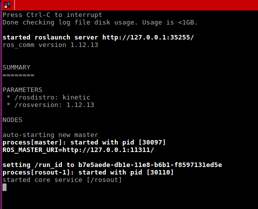

---

**教学代码包的安装**

接下来我们会下载并安装本书配套的ROS-Academy-for-RoboticArm软件包，演示源码包下载-编译-
运行的完整流程。后续章节的主要代码都基于这个软件包，所以希望大家熟悉这一过程。

- 登录重德智能GitHub网页 ： https://github.com/DroidAITech/
- 下载和安装教学软件包：[ROS-Academy-for-RoboticArm](https://github.com/DroidAITech/ROS-Academy-for-RoboticArm)

教学软件包源代码在github上。ROS-Academy-for-RoboticArm教学包是贯穿整个学习过程所使用的教学代码包，本教学包是源码包，需要下载后对其进行编译才可以使用。该教学包中集成了仿真环境，在后续的课程中会大量的用到。
1、确保git已经安装；
2、创建一个名为catkin_ws的工作空间，在它的的src路径下克隆ROS-Academy-for-RoboticArm软件包；
3、安装依赖项，查看gazebo版本；
4、在工作空间下进行编译；
5、source环境变量；
6、运行仿真环境

要点

1.二级制包和源码包

第一步，我们需要弄清楚二进制包和源码包的区别。一般软件包可以分成二进制包和源码包两种，二进制包里包含了已经编译完成，并可以直接运行的程序，源码包里是程序的原始代码，下载完成后必须编译成可执行文件才可以安装。ROS-Academy-for-RoboticArm教学包是源码包。

2.建立工作空间

catkin工作空间是组织和管理包的文件夹，以catkin工具进行编译；catkin工作空间下应该有源码src目录用于存放源代码。第二步就是我们需要建立一个工作空间；ROS的工作空间使用到了catkin，catkin工作空间是组织和管理包的文件夹，以catkin工具进行编译，catkin工作空间下应该有源码src目录用于存放源代码。


3.下载源码包

git clone命令用于从服务器上克隆完整的git仓库（包括代码和版本信息）到单机上；需要将教学源码包克隆到源码目录下。第三步，建立好工作空间后我们需要将教学包源码下载下来，刚刚也说了ROS-Academic-for-Beginners教学包是源码包，需要将其下载并编译才可以使用。


4.安装依赖项

缺少依赖项会导致软件包无法正常编译和运行。第四步，我们需要安装教学包所需要的依赖项，因为缺少依赖项会导致软件包无法正常编译和运行。


5.查看Gazebo版本

第五步，查看Gazebo的版本，gazebo是ROS中的一个实现物理仿真的工具包，gazebo本身就是一款机器人的仿真软件，可以模拟机器人以及环境中的很多物理特性，这一步主要是看一看Gazebo的版本是不是在7.0 以上，如果低于7.0就需要对其进行更新。

6.编译工作空间

最后一步也就是编译，编译的过程中用到了catkin_make，在来学习catkin_make之前我们需要先了解一下cmake，cmake是一个跨平台的编译(Build)工具,可以用简单的语句来描述所有平台的编译过程；cmake的核心是读取一个容易理解的文本文件CMakeLists.txt，通过使用cmake命令根据CMakeLists.txt内容生成对用的项目文件；关于cmake的知识，推荐大家花一些时间去阅读一下《CMake实践》这本书。catkin是ROS定制的编译构建系统，是对cmake的扩展。

**1  二级制包 vs 源码包**

先来看第一个子任务，关于二进制包和源码包的区别，刚刚也已经说到了，二进制包可以直接运行，而源码包需要编译后才可以使用。其中二进制包可以通过sudo apt-get install直接下载并安装；而源码包需要先从网上clone到本地，再进行编译后才可以运行。

**2  建立工作空间**
```bash
$mkdir -p catkin_ws/src
```

其中工作空间“ catkin_ws”部分任意，但工作空间下必须带有src目录。

关于catkin工作空间的组织和结构，这里我们先不介绍，我们会在下一节向大家详细的介绍，在这里我们需要注意的是catkin工作空间下应该有源码src目录用于存放源代码；mkdir -p tutorial_ws/src这个就是建立catkin工作空间的指令，工作空间的名字可以随便取，但是一定要包含src目录。

**3  下载源码包**

```bash
#确保git已经安装
$sudo apt-get install git 

#进入src路径，克隆教学软件包
$cd catkin_ws/src     
$git clone https://github.com/DroidAITech/ROS-Academy-for-RoboticArm.git

#剪切ROS-Academy-for-RoboticArm目录下的包到src
```
建立好工作空间之后，我们需要将教学包源码下载到src目录下用于后续对教学包源码的编译；
首先我们需要在github上找到我们的教学包；
教学包下面有本教学包的安装教程，大家可以根据教程完成对教学包的安装；
下载到本地之前我们需要确认系统中是否已经安装git；
源码需要下载到src目录下，可以通过教学包的地址直接进行clone。

**4  安装依赖**
```bash
#进入catkin_ws目录
$cd catkin_ws

#安装依赖
$rosdep install --from-paths src --ignore-src --rosdistro=kinetic -y
```
下载完代码后，我们需要安装其相应的依赖，缺少依赖会导致软件包无法正常编译和运行。

**5  查看Gazebo版本**

```bash
$gazebo –v
```

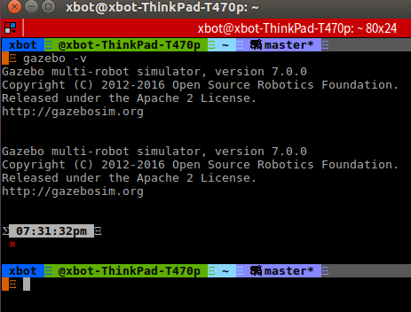

第五个子任务是查看Gazebo的版本，看一下Gazebo的版本是不是在7.0以上；我这里的Gazebo的版本是高于7.0 的。如果版本过低，那就需要对其进行升级；具体的升级指令在这里，我就不再演示了。

```bash
$sudo sh -c 'echo "deb http://packages.osrfoundation.org/gazebo/ubuntu-stable `lsb_release -cs` main" > /etc/apt/sources.list.d/gazebo-stable.list'
$wget http://packages.osrfoundation.org/gazebo.key -O - | sudo apt-key add -
$sudo apt-get update
$sudo apt-get install gazebo7
```

Gazebo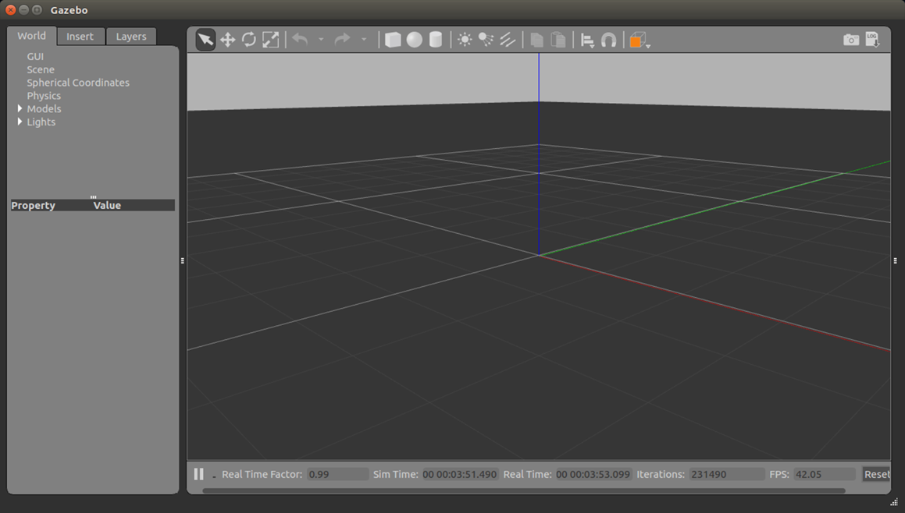

这里说到Gazebo，我们可以打开看一下，Gazebo到底长啥样。
```bash
#打开一个空的Gazebo世界
$roslaunch gazebo_ros empty_world.launch
```

**6  编译工作空间**

```bash
#进入工作空间
$cd ~/catkin_ws

#编译
$catkin_make；         

#刷新环境变量
$source ~/catkin_ws/devel/setup.bash

上述刷新环境变量方法只在本终端中有效，在新开的终端中需要重新刷新环境变量，为解决此问题，可将刷新指令添加到~/.bashrc文件中：

echo "source ~/catkin_ws/devel/setup.bash" >> ~/.bashrc
```
添加ROS Master和本机地址与端口

```bash
$vim ~/.bashrc

#添加ROS_MASTER_URI
$export ROS_MASTER_URI=http://127.0.0.1:11311

#添加ROS_HOSTNAME
export ROS_HOSTNAME=127.0.0.1
```

接下来就是本次教学包安装的最后一步了，编译。

需要注意的是编译必须在源码所在的工作空间目录下。
编译完成后必须刷新一下工作空间的环境，通过输入指令：source ~/catkin_ws/devel/setup.bash来刷新环境，但是这样只满足于当前终端，在其他终端中需要重新刷新，为了使每次打开终端不用重新刷新环境，可以将source命令追加到~/.bashrc文件中。

```bash
#1、打开终端，cd进入刚刚建好的工作空间下
$ cd ~/catkin_ws

#2、输入指令：catkin_make 进行编译
$catkin_make

#3、输入指令：source ~/catkin_ws/devel/setup.bash更新环境
$source ~/catkin_ws/devel/setup.bash

#4、输入指令：echo "source ~/catkin_ws/devel/setup.bash" >> ~/.bashrc
$echo "source ~/catkin_ws/devel/setup.bash" >> ~/.bashrc
```

